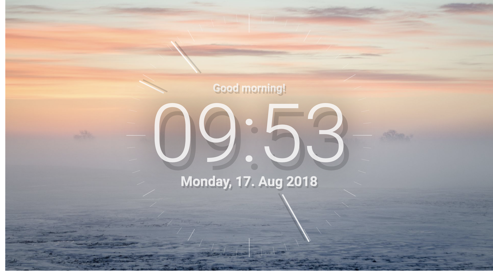

# New Tab Extension

 1. Open the Chrome extension settings.
 2. Activate developer mode.
 3. Press load extension and select the `src` folder of this repository. Done.

## Future stuff

 1. Add this extension to the official extension store.
 2. Add some settings and localization.
